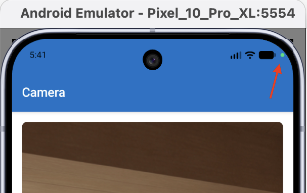

# Lesson 2.18: Integration of Native Device Capabilities in Cross-Platform Applications

## Overview

- **Duration:** ~2 hours (hands-on lab)
- **Prerequisites:** Lesson 2.17 (React Navigation: tab and stack navigators, `NavigationContainer`, route params, `useFocusEffect`)

## Learning Objectives

By the end of this lesson, you will be able to:

1. **Configure** iOS and Android permissions for native device features using Expo's `app.json` plugin system
2. **Integrate** `expo-camera` and `expo-media-library` to build a camera screen with live preview, photo capture, and QR code scanning
3. **Use** `expo-image-picker` to let users select media from the device library
4. **Implement** location-based features using `expo-location` and display coordinates on a map with `react-native-maps`
5. **Build** an authenticated navigation shell with `AuthContext`, conditional navigator rendering, and biometric login via `expo-local-authentication`
6. **Persist** login state across app restarts using `AsyncStorage` (optional, if time permits)

---

## Introduction

Mobile devices have hardware and OS-level capabilities that web browsers cannot access the same way: the camera, GPS, the photo library, biometric sensors. These features are what make apps like Instagram, Google Maps, and banking apps possible.

In React Native, accessing these features requires two things. First, your app must **declare** which capabilities it intends to use, so the operating system knows to include the relevant permissions at build time. Second, your app must **request** permission from the user at runtime before using the feature.

Expo simplifies both steps. You declare permissions in `app.json`, and Expo injects them into the platform-specific config files (`Info.plist` on iOS, `AndroidManifest.xml` on Android). Then Expo's SDK libraries provide consistent JavaScript APIs for actually using the features, regardless of whether the user is on iOS or Android.

> iOS and Android handle permissions differently. iOS requires a custom message string (a "usage description") for each permission: this is the text shown to the user in the system dialog. Android prompts the user at runtime without needing a custom string. You will see both approaches as you work through this lesson.

In this lesson you will build **Explorer App**: a four-screen tabbed app with a camera, a photo gallery picker, a live location map, and a complete authentication flow including biometric login and persistent sessions.

---

## Setup: Create the Project (10 min)

Create a fresh Expo app and install all navigation dependencies at once:

```bash
# Remember to select Expo SDK 54 when prompted
npx create-expo-app --template blank explorer-app
```

Open in VS Code:

```bash
cd explorer-app
code .
```

Open the terminal and install eslint and navigation dependencies:

```bash
npx expo lint
npx expo install @react-navigation/native @react-navigation/bottom-tabs react-native-screens react-native-safe-area-context @react-native-vector-icons/ionicons
```

Create the following folder structure:

```
explorer-app/
├── App.js
├── app.json
├── contexts/
├── navigation/
├── screens/
└── styles/
```

Create the shared style files first. All screens will import from them.

`styles/colors.js`:

```js
// styles/colors.js
export const Colors = {
  PRIMARY: "#1971c2",
  PRIMARY_LIGHT_1: "#4dabf7",
  PRIMARY_LIGHT_2: "#e7f5ff",
  WHITE: "#fff",
};
```

`styles/common.js`:

```js
// styles/common.js
import { StyleSheet } from "react-native";
import { Colors } from "./colors";

export const commonStyles = StyleSheet.create({
  container: {
    flex: 1,
    padding: 16,
    backgroundColor: Colors.WHITE,
  },
});
```

Run the app on your emulator or device via Expo Go:

```bash
npx expo start
```

**Device check:** the blank app loads on the emulator or device.

---

## Part 1: Tab Navigation Shell (12 min)

Before adding any native features, set up the navigation structure the rest of the lesson builds on. This reuses what you learned in Lesson 2.17.

### Step 1: Create stub screens

Create four minimal screen files. Each just displays its name for now so you can verify the tabs work before filling in the real content.

`screens/HomeScreen.js`:

```jsx
// screens/HomeScreen.js
import { Text, View } from "react-native";
import { commonStyles } from "../styles/common";

function HomeScreen() {
  return (
    <View style={commonStyles.container}>
      <Text>Home</Text>
    </View>
  );
}

export default HomeScreen;
```

Create `screens/CameraScreen.js`, `screens/LocationScreen.js`, and `screens/SettingsScreen.js` using the same structure, substituting the label text for each.

### Step 2: Build the tab navigator

Create `navigation/TabNavigator.js`:

```jsx
// navigation/TabNavigator.js
import { createBottomTabNavigator } from "@react-navigation/bottom-tabs";
import Ionicons from "@react-native-vector-icons/ionicons";
import { Colors } from "../styles/colors";
import HomeScreen from "../screens/HomeScreen";
import CameraScreen from "../screens/CameraScreen";
import LocationScreen from "../screens/LocationScreen";
import SettingsScreen from "../screens/SettingsScreen";

const Tab = createBottomTabNavigator();

function TabNavigator() {
  return (
    <Tab.Navigator
      screenOptions={{
        headerStyle: { backgroundColor: Colors.PRIMARY },
        headerTintColor: Colors.WHITE,
        tabBarActiveTintColor: Colors.PRIMARY,
      }}
    >
      <Tab.Screen
        name="Home"
        component={HomeScreen}
        options={{
          tabBarIcon: ({ color, size }) => (
            <Ionicons name="home" size={size} color={color} />
          ),
        }}
      />
      <Tab.Screen
        name="Camera"
        component={CameraScreen}
        options={{
          tabBarIcon: ({ color, size }) => (
            <Ionicons name="camera" size={size} color={color} />
          ),
        }}
      />
      <Tab.Screen
        name="Location"
        component={LocationScreen}
        options={{
          tabBarIcon: ({ color, size }) => (
            <Ionicons name="location" size={size} color={color} />
          ),
        }}
      />
      <Tab.Screen
        name="Settings"
        component={SettingsScreen}
        options={{
          tabBarIcon: ({ color, size }) => (
            <Ionicons name="settings" size={size} color={color} />
          ),
        }}
      />
    </Tab.Navigator>
  );
}

export default TabNavigator;
```

Wire it up in `App.js`:

```jsx
// App.js
import { NavigationContainer } from "@react-navigation/native";
import { StatusBar } from "expo-status-bar";
import TabNavigator from "./navigation/TabNavigator";

export default function App() {
  return (
    <NavigationContainer>
      <TabNavigator />
      <StatusBar style="auto" />
    </NavigationContainer>
  );
}
```

**Device check:** four tabs appear at the bottom with icons and labelled headers. Switching tabs shows each stub screen.

---

## Part 2: Home Screen with Gallery Picker (`expo-image-picker`) (12 min)

The Home screen is the simplest native integration in the app: opening the device photo library and displaying a selected image. No camera is used here, and no permission needs to be requested before the picker opens: `launchImageLibraryAsync` triggers the system permission dialog automatically the first time it is called.

### Step 1: Install and configure `expo-image-picker`

```bash
npx expo install expo-image-picker
```

Open `app.json` and add the plugin with an iOS permission string. iOS requires this string to be declared at build time; it is the exact text shown to the user in the system permission dialog.

```json
// app.json
{
  "expo": {
    "plugins": [
      [
        "expo-image-picker",
        {
          "photosPermission": "The app accesses your photos to let you share them."
        }
      ]
    ]
  }
}
```

The `expo-image-picker` plugin accepts three permission keys: `photosPermission`, `cameraPermission`, and `microphonePermission`. Only declare the ones your app actually uses. `photosPermission` maps to `NSPhotoLibraryUsageDescription` on iOS and covers `launchImageLibraryAsync`, which is the only function this screen calls. `cameraPermission` and `microphonePermission` only matter if the app also calls `launchCameraAsync` to capture new photos or videos, which this screen does not do. Declaring permissions your app does not use is a common anti-pattern: it prompts users for access they never see a reason for, which increases the chance they deny the request. The Camera screen in Part 3 declares its own `cameraPermission` string separately, scoped to where it is actually used.

### Step 2: Build HomeScreen

Replace the stub content of `screens/HomeScreen.js`:

```jsx
// screens/HomeScreen.js
import { useState } from "react";
import { Button, Image, StyleSheet, Text, View } from "react-native";
import * as ImagePicker from "expo-image-picker";
import { commonStyles } from "../styles/common";

function HomeScreen() {
  const [image, setImage] = useState(null);

  const pickImage = async () => {
    try {
      const result = await ImagePicker.launchImageLibraryAsync({
        mediaTypes: ["images"],
        allowsEditing: true,
        aspect: [4, 3],
        quality: 1,
      });
      if (!result.canceled) {
        setImage(result.assets[0].uri);
      }
    } catch (error) {
      alert("Error picking image: " + error.message);
    }
  };

  return (
    <View style={commonStyles.container}>
      <Text>Welcome to the Explorer App</Text>
      <Text style={{ marginBottom: 16 }}>
        Discover new places and experiences!
      </Text>
      <Button title="Pick an Image" onPress={pickImage} />
      {image && <Image source={{ uri: image }} style={styles.image} />}
    </View>
  );
}

const styles = StyleSheet.create({
  image: {
    width: "100%",
    aspectRatio: 4 / 3,
    borderRadius: 8,
    marginTop: 16,
  },
});

export default HomeScreen;
```

The `result` object from `launchImageLibraryAsync` has this shape:

- `result.canceled`: `true` if the user closed the picker without selecting anything
- `result.assets`: an array of selected items; `result.assets[0].uri` is the local file path of the chosen image
- `allowsEditing: true` and `aspect` activate the built-in crop UI before the image is returned
- `mediaTypes: ["images"]` restricts the picker to photos only. The screen renders the result with `<Image>`, which cannot play video; if `"videos"` were included, a user selecting a video would produce a broken image instead of a preview.

**Device check:** tapping "Pick an Image" opens the system photo picker. Selecting a photo displays it below the button. On the emulator, use the photos already in the emulator's library.

---

## Part 3: Camera Screen with Live Preview, Photo Capture, and QR Scanning (35 min)

The Camera screen builds three features in sequence: a live viewfinder with permission handling, a button to capture and save a photo, and QR/barcode scanning that navigates to a result screen.

### Step 1: Install and configure `expo-camera` and `expo-media-library`

```bash
npx expo install expo-camera expo-media-library
```

> **Restart the dev server after installing.** Packages like `expo-camera` and `expo-media-library` include native code, not just JavaScript. A Fast Refresh is not enough for Expo Go to pick up newly registered native modules: stop `npx expo start` and run it again. If the camera still fails to load afterward, fully close and reopen the app in Expo Go rather than only reloading it.

Add the camera plugin to `app.json` alongside the existing image picker entry:

```json
// app.json
{
  "expo": {
    "plugins": [
      [
        "expo-image-picker",
        {
          "photosPermission": "The app accesses your photos to let you share them."
        }
      ],
      [
        "expo-camera",
        {
          "cameraPermission": "Allow $(PRODUCT_NAME) to access your camera",
          "microphonePermission": false,
          "recordAudioAndroid": false
        }
      ]
    ]
  }
}
```

This screen only takes still photos with `takePictureAsync` and scans barcodes; it never records video. `microphonePermission` is explicitly set to `false` rather than omitted, because the `expo-camera` plugin adds a microphone usage string by default even if the key is left out. Setting it to `false` suppresses `NSMicrophoneUsageDescription` on iOS. `recordAudioAndroid: false` does the same for the `RECORD_AUDIO` permission on Android. Requesting microphone access the app never uses would be confusing to users and, in a production app, would need to be justified to app store reviewers.

### Step 2: Handle permissions and show the live viewfinder

Replace the stub content of `screens/CameraScreen.js`:

```jsx
// screens/CameraScreen.js
import { useRef, useState } from "react";
import { Button, StyleSheet, Text, TouchableOpacity, View } from "react-native";
import { CameraView, useCameraPermissions } from "expo-camera";
import Ionicons from "@react-native-vector-icons/ionicons";
import { commonStyles } from "../styles/common";
import { Colors } from "../styles/colors";

function CameraScreen() {
  const [facing, setFacing] = useState("back");
  const [permission, requestPermission] = useCameraPermissions();
  const cameraRef = useRef(null);

  if (!permission) {
    return <View />;
  }

  if (!permission.granted) {
    return (
      <View style={styles.permissionContainer}>
        <Text style={styles.permissionMessage}>
          We need your permission to show the camera.
        </Text>
        <Button onPress={requestPermission} title="Grant Permission" />
      </View>
    );
  }

  const toggleCameraFacing = () => {
    setFacing((current) => (current === "back" ? "front" : "back"));
  };

  return (
    <View style={commonStyles.container}>
      <CameraView facing={facing} style={styles.camera} ref={cameraRef} />
      <View style={styles.buttonsContainer}>
        <TouchableOpacity onPress={toggleCameraFacing} style={styles.button}>
          <Text style={styles.buttonText}>Flip Camera</Text>
          <Ionicons name="camera-reverse" size={36} color={Colors.WHITE} />
        </TouchableOpacity>
      </View>
    </View>
  );
}

const styles = StyleSheet.create({
  permissionContainer: {
    flex: 1,
    justifyContent: "center",
    alignItems: "center",
  },
  permissionMessage: {
    textAlign: "center",
    marginBottom: 8,
  },
  camera: {
    flex: 1,
    borderRadius: 8,
    overflow: "hidden",
  },
  buttonsContainer: {
    flexDirection: "row",
    justifyContent: "center",
    gap: 20,
    position: "absolute",
    bottom: 64,
    left: 0,
    right: 0,
  },
  button: {
    flexDirection: "row",
    justifyContent: "center",
    alignItems: "center",
    gap: 8,
    backgroundColor: `${Colors.PRIMARY}80`,
    paddingHorizontal: 16,
    paddingVertical: 8,
    borderRadius: 8,
  },
  buttonText: {
    color: Colors.WHITE,
    fontSize: 12,
    textTransform: "uppercase",
    fontWeight: "bold",
  },
});

export default CameraScreen;
```

`` `${Colors.PRIMARY}80` `` appends `80` to the end of the hex colour, an alpha channel that makes the button background semi-transparent so the live camera feed stays partially visible behind it.

`useCameraPermissions` returns a `[permission, requestPermission]` pair. The two guard clauses at the top handle the two states before the camera can be shown:

- `!permission`: the permission status has not loaded yet (this is brief on first mount). Return an empty view to avoid a flash of incorrect UI.
- `!permission.granted`: the user has not granted access yet, or has denied it. Show a prompt with a button that calls `requestPermission`.

**Device check:** the permission dialog appears on first launch. Accepting shows the live viewfinder. Tapping "Flip Camera" switches between front and back cameras.

On the Android emulator, the camera shows a simulated room scene. On the iOS Simulator, the camera is not available; use a physical device with Expo Go.

### Step 3: Unmount the camera when the screen is not focused

Open the Camera tab so the viewfinder is showing, then switch to the Home tab. Switch back to Camera: the viewfinder is already there with no delay, as if it had been running the whole time. Check the device's camera indicator (the green dot on iOS, the camera icon in the status bar on Android) while sitting on the Home tab: it is still lit. The camera never actually stopped.



React Navigation does not unmount tab screens when you switch tabs; it keeps them mounted in the background so that switching back is instant. That is fine for most screens, but not for `CameraView`: left mounted, it keeps the camera hardware active, keeps the indicator lit, and keeps draining battery while the user is looking at a completely different tab. `expo-camera` also expects only one active `CameraView` at a time, so a hidden one left running in the background is a source of crashes, not just wasted resources.

Fix this with `useIsFocused` from `@react-navigation/native`. It returns `true` only while this screen is the active one and `false` the moment focus moves anywhere else, whether that is another tab or a new screen pushed on top of this one.

Update the imports in `screens/CameraScreen.js`:

```jsx
// screens/CameraScreen.js
import { useIsFocused } from "@react-navigation/native";
```

Call the hook inside `CameraScreen`, alongside the other hooks:

```jsx
// screens/CameraScreen.js
const isFocused = useIsFocused();
```

Wrap `CameraView` so it only renders while the screen is focused:

```jsx
// screens/CameraScreen.js
{isFocused && (
  <CameraView facing={facing} style={styles.camera} ref={cameraRef} />
)}
```

Unmounting the component while off-screen and mounting a fresh one on return is the fix: re-establishing the camera session on return is fast, so nothing is lost by not keeping it warm in the background.

**Device check:** with the fix in place, switch to another tab while Camera is open, and check the camera indicator: it should turn off. Switch back to Camera: the viewfinder briefly disappears and reappears, and the indicator turns back on.

### Step 4: Capture a photo and save it to the media library

The camera permission and the media library permission are separate. A user can grant camera access but deny the right to save photos, so always check the media library permission before saving.

Add the `takePhoto` function to `CameraScreen`, just above the `return`:

```jsx
// screens/CameraScreen.js
import * as MediaLibrary from "expo-media-library";
import { Alert } from "react-native";

const takePhoto = async () => {
  if (!cameraRef.current) return;
  try {
    const { status } = await MediaLibrary.requestPermissionsAsync(true);
    if (status !== "granted") {
      Alert.alert(
        "Permission Required",
        "Media Library permission is required to save photos.",
      );
      return;
    }
    const photo = await cameraRef.current.takePictureAsync();
    await MediaLibrary.createAssetAsync(photo.uri);
    Alert.alert("Photo Taken", "Photo saved to media library.");
  } catch (error) {
    console.log("Error taking photo:", error);
  }
};
```

Media library permission is requested inside `takePhoto` rather than on screen mount, on both iOS and Android. This way the user is not hit with two permission dialogs back to back when they first open the camera screen, and only sees the media library prompt once they actually try to save a photo.

`requestPermissionsAsync(true)` passes `writeOnly: true`. Saving a photo the camera just captured only needs permission to add a new asset, not to read the rest of the user's existing photo library, so requesting write-only access is both more precise and less alarming to the user than asking for full read/write access. On Android 13 and later, this maps to the narrower permission Android grants for an app's own media writes, rather than the broader `READ_MEDIA_IMAGES` permission.

Add a "Take Photo" button alongside the flip button inside `buttonsContainer`:

```jsx
// screens/CameraScreen.js
<TouchableOpacity onPress={takePhoto} style={styles.button}>
  <Text style={styles.buttonText}>Take Photo</Text>
  <Ionicons name="camera" size={36} color={Colors.WHITE} />
</TouchableOpacity>
```

**Device check:** tapping "Take Photo" saves a photo and shows the confirmation alert. Open the device photo library to verify the photo is there.

> **Common mistake:** calling `MediaLibrary.createAssetAsync` before requesting the media library permission. The call will silently fail or throw on both platforms. Always check the permission first, even if the camera permission has already been granted; they are independent, and on Android 13 and later the media library permission is no longer granted automatically.

### Step 5: Add QR and barcode scanning

`CameraView` supports barcode scanning via the `onBarcodeScanned` prop. When a handler is passed, the camera scans continuously and calls the handler every time it detects a code, receiving `{ type, data }`.

The scanned result should open a new screen. `BarcodeResultScreen` should not be in the tab bar, so it must live in a stack navigator that wraps the tab navigator. Add it to the `navigation/` folder now.

Create `screens/BarcodeResultScreen.js`:

```jsx
// screens/BarcodeResultScreen.js
import { Button, StyleSheet, Text, View } from "react-native";
import { commonStyles } from "../styles/common";

function BarcodeResultScreen({ route, navigation }) {
  const { barcodeData } = route.params;

  return (
    <View style={commonStyles.container}>
      <Text style={styles.title}>Barcode Result</Text>
      <Text style={styles.barcodeText}>{barcodeData}</Text>
      <Button title="Go Back" onPress={() => navigation.goBack()} />
    </View>
  );
}

const styles = StyleSheet.create({
  title: { fontSize: 24, fontWeight: "bold", marginBottom: 16 },
  barcodeText: { fontSize: 18, marginBottom: 24 },
});

export default BarcodeResultScreen;
```

`BarcodeResultScreen` needs a stack navigator, which was not installed in the setup step. Install `@react-navigation/native-stack`, the same package used for stack navigation in Lesson 2.17:

```bash
npx expo install @react-navigation/native-stack
```

Create `navigation/AppStackNavigator.js`. This wraps `TabNavigator` as its first screen (with `headerShown: false` so only one header is visible at a time) and registers `BarcodeResultScreen` as a second screen reachable from anywhere inside the tabs:

```jsx
// navigation/AppStackNavigator.js
import { createNativeStackNavigator } from "@react-navigation/native-stack";
import { Colors } from "../styles/colors";
import TabNavigator from "./TabNavigator";
import BarcodeResultScreen from "../screens/BarcodeResultScreen";

const Stack = createNativeStackNavigator();

function AppStackNavigator() {
  return (
    <Stack.Navigator
      screenOptions={{
        headerStyle: { backgroundColor: Colors.PRIMARY },
        headerTintColor: Colors.WHITE,
        headerBackButtonDisplayMode: "minimal",
      }}
    >
      <Stack.Screen
        name="Tabs"
        component={TabNavigator}
        options={{ headerShown: false }}
      />
      <Stack.Screen
        name="BarcodeResult"
        component={BarcodeResultScreen}
        options={{ title: "Barcode Result" }}
      />
    </Stack.Navigator>
  );
}

export default AppStackNavigator;
```

By default, the back button on `BarcodeResultScreen`'s header would show the label of the previous screen on the stack, which is the `Stack.Screen` named `"Tabs"`, not "Camera." `headerBackButtonDisplayMode: "minimal"` removes the label entirely on iOS, leaving just the back arrow, which avoids the misleading text. If a specific label is preferred instead, set `headerBackTitle: "Camera"` in `BarcodeResultScreen`'s own `options` to override it directly.

Update `App.js` to use `AppStackNavigator` instead of `TabNavigator`:

```jsx
// App.js
import { NavigationContainer } from "@react-navigation/native";
import { StatusBar } from "expo-status-bar";
import AppStackNavigator from "./navigation/AppStackNavigator";

export default function App() {
  return (
    <NavigationContainer>
      <AppStackNavigator />
      <StatusBar style="auto" />
    </NavigationContainer>
  );
}
```

Now wire up the barcode handler in `CameraScreen`. Because `CameraScreen` is a registered tab screen, the `navigation` prop is automatically provided; add it to the function signature:

```jsx
// screens/CameraScreen.js
function CameraScreen({ navigation }) {
```

Add the handler and pass it to `CameraView`:

```jsx
// screens/CameraScreen.js
const handleBarcodeScanned = ({ type, data }) => {
  navigation.navigate("BarcodeResult", { barcodeData: data });
};
```

Update `CameraView` in the `return`, keeping the `isFocused` guard from Step 3:

```jsx
// screens/CameraScreen.js
{isFocused && (
  <CameraView
    facing={facing}
    style={styles.camera}
    ref={cameraRef}
    onBarcodeScanned={handleBarcodeScanned}
  />
)}
```

**Device check:** point the camera at a QR code. The app navigates to `BarcodeResultScreen` showing the decoded data. Tapping "Go Back" returns to the Camera tab.

---

## Activity 1: Fix the Repeated Scan Problem (10 min)

`onBarcodeScanned` does not fire once per physical scan; it fires once per camera frame that contains a recognisable code, typically many times a second. Pointing the camera at a single QR code for even a brief moment calls `handleBarcodeScanned` repeatedly, not once. `navigation.navigate` does not push a duplicate `BarcodeResultScreen` for each of those calls (calling it again with the same screen name just updates that screen's params instead of pushing a new one), but `handleBarcodeScanned` itself still runs every time, and any side effect inside it (haptics, a sound, an analytics event) would fire repeatedly too, right up until `useIsFocused` catches up and unmounts the camera on blur. Navigation focus changes are not instant, so there is a real, common window (not a rare edge case) where several redundant scans happen before that unmount takes effect.

Your task: make `CameraScreen` stop scanning as soon as a code is detected, so `handleBarcodeScanned` only runs once per visit, rather than once per frame the code stays in view. Scanning should resume once the user returns to the Camera tab; if the same code is still in frame at that point, scanning it again and navigating again is expected behaviour, not a bug.

**Hints:**

1. Add a state variable `isScanned` (boolean, starts `false`). Set it to `true` inside `handleBarcodeScanned` before navigating.
2. When `isScanned` is `true`, pass `undefined` to `onBarcodeScanned` instead of the handler function. Setting the prop to `undefined` pauses scanning.
3. Use `useFocusEffect` (from `@react-navigation/native`) to reset `isScanned` back to `false` each time the screen comes into focus, so the user can scan again after returning.
4. `useFocusEffect` requires its callback to be wrapped in `useCallback`.

<details>
<summary>Reference solution</summary>

```jsx
// screens/CameraScreen.js
import { useCallback, useRef, useState } from "react";
import { useFocusEffect, useIsFocused } from "@react-navigation/native";

function CameraScreen({ navigation }) {
  const [facing, setFacing] = useState("back");
  const [permission, requestPermission] = useCameraPermissions();
  const [isScanned, setIsScanned] = useState(false);
  const isFocused = useIsFocused();
  const cameraRef = useRef(null);

  useFocusEffect(
    useCallback(() => {
      setIsScanned(false);
    }, []),
  );

  // ... permission guards ...

  const handleBarcodeScanned = ({ type, data }) => {
    setIsScanned(true);
    navigation.navigate("BarcodeResult", { barcodeData: data });
  };

  return (
    <View style={commonStyles.container}>
      {isFocused && (
        <CameraView
          facing={facing}
          style={styles.camera}
          ref={cameraRef}
          onBarcodeScanned={isScanned ? undefined : handleBarcodeScanned}
        />
      )}
      {/* ... buttons ... */}
    </View>
  );
}
```

`isScanned` and `isFocused` are solving different problems even though both end up gating the same prop and JSX: `isFocused` unmounts the camera entirely once focus has actually moved away, which also covers the tab-switch case from earlier in this lesson; `isScanned` stops the scan callback the instant a code is detected, closing the shorter gap before that unmount takes effect.

</details>

---

## Activity 2: Add Haptic Feedback on Scan (5 min)

A live camera viewfinder gives no confirmation that a scan actually worked until `BarcodeResultScreen` appears a moment later. A short vibration the instant a code is detected gives the user immediate physical confirmation, before the screen transition even completes. This is a common pattern in scanning apps (think of a supermarket self-checkout scanner beeping on every item).

`expo-haptics` provides this. It needs no `app.json` plugin and no runtime permission request; on Android the required `VIBRATE` permission is added automatically when the package is installed.

Your task: trigger a success haptic the moment a barcode is detected, inside `handleBarcodeScanned`, before navigating to `BarcodeResultScreen`.

**Hints:**

1. Install the package: `npx expo install expo-haptics`.
2. Import it with `import * as Haptics from "expo-haptics"`.
3. `Haptics.notificationAsync(Haptics.NotificationFeedbackType.Success)` triggers a success-style vibration pattern. It returns a promise, but nothing in `handleBarcodeScanned` needs to wait for it to resolve.
4. Call it as the first line inside `handleBarcodeScanned`, before `setIsScanned(true)` and `navigation.navigate`.

<details>
<summary>Reference solution</summary>

```jsx
// screens/CameraScreen.js
import * as Haptics from "expo-haptics";

const handleBarcodeScanned = ({ type, data }) => {
  Haptics.notificationAsync(Haptics.NotificationFeedbackType.Success);
  setIsScanned(true);
  navigation.navigate("BarcodeResult", { barcodeData: data });
};
```

Because `isScanned` from Activity 1 already stops `handleBarcodeScanned` from running more than once per visit, the haptic also fires only once per scan, not once per frame. Without that guard, the device would buzz repeatedly for a fraction of a second on every detection, which would feel broken rather than responsive.

</details>

**Device check:** point the camera at a QR code on a physical device (the emulator/simulator cannot simulate vibration). The device should vibrate once, immediately, right as the app navigates to `BarcodeResultScreen`.

---

## Part 4: Location Screen with `expo-location` and `react-native-maps` (15 min)

### Step 1: Install dependencies

```bash
npx expo install expo-location react-native-maps
```

Add the `expo-location` plugin to `app.json`:

```json
// app.json
[
  "expo-location",
  {
    "locationAlwaysAndWhenInUsePermission": "Allow the app to use your location."
  }
]
```

### Step 2: Build LocationScreen

Unlike the camera, the location permission is requested inside the `getLocation` handler rather than on mount. This way the user only sees the permission dialog when they actively tap the button, not as soon as they open the tab.

Replace the stub content of `screens/LocationScreen.js`:

```jsx
// screens/LocationScreen.js
import { useState } from "react";
import {
  ActivityIndicator,
  Button,
  StyleSheet,
  Text,
  View,
} from "react-native";
import * as Location from "expo-location";
import MapView, { Marker } from "react-native-maps";
import { commonStyles } from "../styles/common";
import { Colors } from "../styles/colors";

function LocationScreen() {
  const [location, setLocation] = useState(null);
  const [retrievingLocation, setRetrievingLocation] = useState(false);

  const getLocation = async () => {
    const { status } = await Location.requestForegroundPermissionsAsync();
    if (status !== "granted") {
      alert("Permission to access location was denied.");
      return;
    }
    setRetrievingLocation(true);
    try {
      const retrievedLocation = await Location.getCurrentPositionAsync({});
      setLocation(retrievedLocation);
    } catch (error) {
      alert("Error retrieving location: " + error.message);
    } finally {
      setRetrievingLocation(false);
    }
  };

  return (
    <View style={commonStyles.container}>
      <Button title="Get Location" onPress={getLocation} />
      {location && (
        <Text>
          Your coordinates: {location.coords.latitude},{" "}
          {location.coords.longitude}
        </Text>
      )}
      {retrievingLocation && (
        <ActivityIndicator size="large" color={Colors.PRIMARY} />
      )}
      {location?.coords && (
        <MapView
          style={styles.map}
          initialRegion={{
            latitude: location.coords.latitude,
            longitude: location.coords.longitude,
            latitudeDelta: 0.01,
            longitudeDelta: 0.01,
          }}
        >
          <Marker
            coordinate={{
              latitude: location.coords.latitude,
              longitude: location.coords.longitude,
            }}
            title="You are here"
          />
        </MapView>
      )}
    </View>
  );
}

const styles = StyleSheet.create({
  map: {
    flex: 1,
    width: "100%",
    marginTop: 16,
    borderRadius: 8,
  },
});

export default LocationScreen;
```

Two things to note:

- `requestForegroundPermissionsAsync` requests permission to access location while the app is in the foreground. There is also a `requestBackgroundPermissionsAsync` for apps that need location when minimised, but that is not needed here.
- `location?.coords &&` uses optional chaining to guard against rendering `MapView` before location has been set. Without the guard, accessing `location.coords` when `location` is `null` would throw.

**Device check:** tapping "Get Location" shows the permission dialog. After granting, coordinates appear and a map renders centred on the current position with a "You are here" marker.

Emulators and simulators do not have real GPS hardware, so they report a default simulated location instead of where the computer actually is. The Android emulator defaults to Google's headquarters in Mountain View, California. The iOS Simulator defaults to Apple's flagship retail store in Union Square, San Francisco. Do not be surprised if the marker does not appear anywhere near you: this is expected. To change it, set a simulated location via Extended Controls > Location on the Android emulator, or Features > Location > Custom Location on the iOS Simulator.

---

## Part 5: Authenticated Navigation Shell (25 min)

This section adds a login flow to the app. `AuthContext` holds authentication state using the Context API from Lesson 2.6, and `App.js` renders either the auth screens or the main app depending on whether the user is logged in.

> **Scope of this section.** `AuthContext` in this lesson is a demonstration of how to call `expo-local-authentication` and structure a navigator around an authentication state, not a template for production authentication. `login` accepts any input without verifying it against a server, and `biometricLogin` only confirms that the device owner passed a local biometric check, it does not issue or refresh any server-side session. A real app needs a backend that verifies credentials, issues short-lived tokens with a refresh mechanism, and stores those tokens in `expo-secure-store` rather than `AsyncStorage`. Mobile authentication and session security are their own subject, governed by guidelines such as the [OWASP Mobile Application Security](https://owasp.org/www-project-mobile-app-security/) project, and are out of scope for this lesson. The goal here is to see the native APIs work, not to build a secure login system.

### Step 1: Install `expo-local-authentication`

```bash
npx expo install expo-local-authentication
```

This library provides access to Face ID, fingerprint, and device PIN for biometric authentication.

Add the `expo-local-authentication` plugin to `app.json`:

```json
// app.json
[
  "expo-local-authentication",
  {
    "faceIDPermission": "Allow $(PRODUCT_NAME) to use Face ID."
  }
]
```

`faceIDPermission` maps to `NSFaceIDUsageDescription` on iOS. Without it, `authenticateAsync` does not use Face ID on a Face ID device: it either fails outright or falls back to the device passcode, and an app built without this string can be rejected during App Store review. Android needs no equivalent entry; the plugin adds the required permissions to the manifest automatically.

### Step 2: Create `AuthContext`

Create `contexts/AuthContext.js`. This is the single source of truth for authentication state. It exposes three functions: `login`, `logout`, and `biometricLogin`.

```jsx
// contexts/AuthContext.js
import { createContext, useState } from "react";
import * as LocalAuthentication from "expo-local-authentication";

const AuthContext = createContext();

export function AuthProvider({ children }) {
  const [isAuthenticated, setIsAuthenticated] = useState(false);

  const login = (username, password) => {
    // In a real app: call an API, verify credentials, then store the returned JWT
    setIsAuthenticated(true);
  };

  const logout = () => {
    setIsAuthenticated(false);
  };

  const biometricLogin = async () => {
    const hasHardware = await LocalAuthentication.hasHardwareAsync();
    const isEnrolled = await LocalAuthentication.isEnrolledAsync();
    if (!hasHardware || !isEnrolled) return false;

    const result = await LocalAuthentication.authenticateAsync({
      promptMessage: "Authenticate with Biometrics",
    });
    if (result.success) {
      setIsAuthenticated(true);
      return true;
    }
    return false;
  };

  return (
    <AuthContext.Provider
      value={{ isAuthenticated, login, logout, biometricLogin }}
    >
      {children}
    </AuthContext.Provider>
  );
}

export default AuthContext;
```

`biometricLogin` checks two things before attempting authentication:

- `hasHardwareAsync`: does the device have a biometric sensor at all?
- `isEnrolledAsync`: has the user enrolled a fingerprint or face?

Both must be true before calling `authenticateAsync`, which triggers the system prompt. `result.success` is `true` if the user authenticated successfully.

### Step 3: Create the auth screens

Create `screens/LoginScreen.js`:

```jsx
// screens/LoginScreen.js
import { useContext, useState } from "react";
import { Button, StyleSheet, Text, TextInput, View } from "react-native";
import Ionicons from "@react-native-vector-icons/ionicons";
import AuthContext from "../contexts/AuthContext";
import { Colors } from "../styles/colors";

function LoginScreen({ navigation }) {
  const [username, setUsername] = useState("");
  const [password, setPassword] = useState("");
  const { login, biometricLogin } = useContext(AuthContext);

  return (
    <View style={styles.container}>
      <Text style={styles.title}>Login</Text>
      <TextInput
        style={styles.input}
        placeholder="Username"
        value={username}
        onChangeText={setUsername}
      />
      <TextInput
        style={styles.input}
        placeholder="Password"
        value={password}
        onChangeText={setPassword}
        secureTextEntry
      />
      <View style={styles.buttonsContainer}>
        <Button title="Login" onPress={() => login(username, password)} />
        <Button
          title="Register"
          onPress={() => navigation.navigate("Register")}
        />
      </View>
      <Ionicons
        name="finger-print"
        size={48}
        color={Colors.PRIMARY}
        onPress={biometricLogin}
      />
    </View>
  );
}

const styles = StyleSheet.create({
  container: {
    flex: 1,
    alignItems: "center",
    justifyContent: "center",
  },
  title: {
    fontSize: 24,
    marginBottom: 24,
  },
  input: {
    width: "80%",
    borderWidth: 1,
    borderColor: "#ccc",
    borderRadius: 4,
    padding: 8,
    marginBottom: 16,
  },
  buttonsContainer: {
    flexDirection: "row",
    gap: 10,
    marginBottom: 24,
  },
});

export default LoginScreen;
```

Create `screens/RegisterScreen.js`. This is a mock; in a real app it would call a registration API, but for now it just shows an alert:

```jsx
// screens/RegisterScreen.js
import { useState } from "react";
import { Alert, Button, StyleSheet, Text, TextInput, View } from "react-native";

function RegisterScreen({ navigation }) {
  const [username, setUsername] = useState("");
  const [password, setPassword] = useState("");

  const handleRegister = () => {
    Alert.alert(
      "Mock Registration",
      "This is just a mock registration function.",
    );
  };

  return (
    <View style={styles.container}>
      <Text style={styles.title}>Register</Text>
      <TextInput
        style={styles.input}
        placeholder="Username"
        value={username}
        onChangeText={setUsername}
      />
      <TextInput
        style={styles.input}
        placeholder="Password"
        value={password}
        onChangeText={setPassword}
        secureTextEntry
      />
      <View style={styles.buttonsContainer}>
        <Button title="Register" onPress={handleRegister} />
        <Button title="Back to Login" onPress={() => navigation.goBack()} />
      </View>
    </View>
  );
}

const styles = StyleSheet.create({
  container: {
    flex: 1,
    alignItems: "center",
    justifyContent: "center",
  },
  title: {
    fontSize: 24,
    marginBottom: 24,
  },
  input: {
    width: "80%",
    borderWidth: 1,
    borderColor: "#ccc",
    borderRadius: 4,
    padding: 8,
    marginBottom: 16,
  },
  buttonsContainer: {
    flexDirection: "row",
    gap: 10,
  },
});

export default RegisterScreen;
```

Update `screens/SettingsScreen.js` to show a logout button:

```jsx
// screens/SettingsScreen.js
import { useContext } from "react";
import { Button, View } from "react-native";
import AuthContext from "../contexts/AuthContext";
import { commonStyles } from "../styles/common";

function SettingsScreen() {
  const { logout } = useContext(AuthContext);

  return (
    <View style={commonStyles.container}>
      <Button title="Logout" onPress={logout} />
    </View>
  );
}

export default SettingsScreen;
```

### Step 4: Create the auth navigator

Create `navigation/AuthStackNavigator.js`. This wraps the two auth screens in a stack navigator with no header; the Login and Register screens manage their own layout:

```jsx
// navigation/AuthStackNavigator.js
import { createNativeStackNavigator } from "@react-navigation/native-stack";
import LoginScreen from "../screens/LoginScreen";
import RegisterScreen from "../screens/RegisterScreen";

const Stack = createNativeStackNavigator();

function AuthStackNavigator() {
  return (
    <Stack.Navigator screenOptions={{ headerShown: false }}>
      <Stack.Screen name="Login" component={LoginScreen} />
      <Stack.Screen name="Register" component={RegisterScreen} />
    </Stack.Navigator>
  );
}

export default AuthStackNavigator;
```

### Step 5: Wire up `App.js` with the auth shell

Update `App.js` to wrap everything in `AuthProvider` and conditionally render either the auth flow or the main app based on `isAuthenticated`:

```jsx
// App.js
import { useContext } from "react";
import { NavigationContainer } from "@react-navigation/native";
import { StatusBar } from "expo-status-bar";
import AuthContext, { AuthProvider } from "./contexts/AuthContext";
import AppStackNavigator from "./navigation/AppStackNavigator";
import AuthStackNavigator from "./navigation/AuthStackNavigator";

function NavigationApp() {
  const { isAuthenticated } = useContext(AuthContext);

  return (
    <NavigationContainer>
      {isAuthenticated ? <AppStackNavigator /> : <AuthStackNavigator />}
      <StatusBar style="auto" />
    </NavigationContainer>
  );
}

export default function App() {
  return (
    <AuthProvider>
      <NavigationApp />
    </AuthProvider>
  );
}
```

`NavigationApp` is a separate component from `App` for an important reason: `useContext` only works inside the provider it reads from. If `useContext(AuthContext)` were called directly inside `App`, it would be outside `<AuthProvider>` and would always read the default context value, meaning `isAuthenticated` would always be `false`.

By splitting `NavigationApp` out as a child of `<AuthProvider>`, it sits inside the provider tree and reads the real value.

**Device check:** the Login screen appears on launch. Entering any username and password and tapping Login switches to the tab navigator. Tapping Logout on the Settings screen returns to Login. On a device with biometrics enrolled, tapping the fingerprint icon triggers the system biometric prompt and logs in on success.

---

## Part 6 (Optional, 12 min): Persisting Login State with `AsyncStorage`

This part and Activity 3, which depends on it, are optional; skip both if you are short on time.

Right now, every time the app restarts, the user must log in again. `AsyncStorage` is a simple key-value store that persists data to disk across app launches. You will use it to save a login flag so returning users go straight to the app.

Unlike the other libraries in this lesson, `AsyncStorage` is not an Expo SDK package: its real name is `@react-native-async-storage/async-storage`, a community-maintained React Native package that predates Expo. `npx expo install` is still the right way to add it, since Expo pins a version compatible with the current SDK even for third-party packages, but it is not part of the `expo-*` family like `expo-camera` or `expo-location`.

### Step 1: Install `AsyncStorage`

```bash
npx expo install @react-native-async-storage/async-storage
```

### Step 2: Save and clear the flag in `AuthContext`

Three changes are needed in `contexts/AuthContext.js`:

1. Save a flag when the user logs in
2. Clear the flag on logout
3. Read the flag on mount and restore the session if it exists

Replace the contents of `contexts/AuthContext.js`:

```jsx
// contexts/AuthContext.js
import { createContext, useEffect, useState } from "react";
import AsyncStorage from "@react-native-async-storage/async-storage";
import * as LocalAuthentication from "expo-local-authentication";

const AuthContext = createContext();

const AUTH_KEY = "isLoggedIn";

export function AuthProvider({ children }) {
  const [isAuthenticated, setIsAuthenticated] = useState(false);

  useEffect(() => {
    const restoreSession = async () => {
      const value = await AsyncStorage.getItem(AUTH_KEY);
      if (value === "true") {
        setIsAuthenticated(true);
      }
    };
    restoreSession();
  }, []);

  const login = async (username, password) => {
    // In a real app: call an API, verify credentials, store the returned JWT
    await AsyncStorage.setItem(AUTH_KEY, "true");
    setIsAuthenticated(true);
  };

  const logout = async () => {
    await AsyncStorage.removeItem(AUTH_KEY);
    setIsAuthenticated(false);
  };

  const biometricLogin = async () => {
    const hasHardware = await LocalAuthentication.hasHardwareAsync();
    const isEnrolled = await LocalAuthentication.isEnrolledAsync();
    if (!hasHardware || !isEnrolled) return false;

    const result = await LocalAuthentication.authenticateAsync({
      promptMessage: "Authenticate with Biometrics",
    });
    if (result.success) {
      await AsyncStorage.setItem(AUTH_KEY, "true");
      setIsAuthenticated(true);
      return true;
    }
    return false;
  };

  return (
    <AuthContext.Provider value={{ isAuthenticated, login, logout, biometricLogin }}>
      {children}
    </AuthContext.Provider>
  );
}

export default AuthContext;
```

`AUTH_KEY` is a named constant for the storage key string. Using a constant avoids typos from writing `"isLoggedIn"` in multiple places.

`login`, `logout`, and `biometricLogin` are now `async` because `AsyncStorage` operations return promises. The `await` before each `setItem` / `removeItem` ensures the write completes before the state update, so the two stay in sync.

**Device check:** log in, then close and reopen the app. The app should open directly to the tab navigator without the Login screen appearing. Tap Logout on the Settings screen, close the app, and reopen it; the Login screen should appear again.

> **Production note:** This lesson stores a simple boolean flag, which is all `AsyncStorage` should ever be trusted with here. In a real app, your login API returns a JWT (JSON Web Token) instead of a flag, and a JWT must never go into `AsyncStorage`: it stores data in plaintext, readable by anything with access to the device's filesystem or an unencrypted backup. A real token belongs in `expo-secure-store`, which stores data in the device's secure enclave (Keychain on iOS, Keystore on Android): `SecureStore.setItemAsync(AUTH_KEY, token)`. Send the retrieved token in the `Authorization` header of subsequent API requests.

---

## Activity 3 (Optional, 10 min): Conditionally Show the Biometric Login Button

This activity is optional; skip it if you are short on time.

The fingerprint icon in `LoginScreen` is always visible, even on emulators or devices where biometrics are not available. On a device with no biometric hardware, tapping it does nothing, which is confusing for users.

Your task: check whether biometric login is actually available and only show the fingerprint icon when it is.

**Hints:**

1. Import `* as LocalAuthentication from "expo-local-authentication"` in `LoginScreen.js`
2. Add a state variable `biometricAvailable` (boolean, starts `false`)
3. In a `useEffect`, call `LocalAuthentication.hasHardwareAsync()` and `LocalAuthentication.isEnrolledAsync()`. Set `biometricAvailable` to `true` only if both return `true`
4. Conditionally render the `Ionicons` fingerprint icon based on `biometricAvailable`

<details>
<summary>Reference solution</summary>

```jsx
// screens/LoginScreen.js
import { useContext, useEffect, useState } from "react";
import * as LocalAuthentication from "expo-local-authentication";

function LoginScreen({ navigation }) {
  const [username, setUsername] = useState("");
  const [password, setPassword] = useState("");
  const [biometricAvailable, setBiometricAvailable] = useState(false);
  const { login, biometricLogin } = useContext(AuthContext);

  useEffect(() => {
    const checkBiometrics = async () => {
      const hasHardware = await LocalAuthentication.hasHardwareAsync();
      const isEnrolled = await LocalAuthentication.isEnrolledAsync();
      setBiometricAvailable(hasHardware && isEnrolled);
    };
    checkBiometrics();
  }, []);

  return (
    <View style={styles.container}>
      {/* ... inputs and buttons ... */}
      {biometricAvailable && (
        <Ionicons
          name="finger-print"
          size={48}
          color={Colors.PRIMARY}
          onPress={biometricLogin}
        />
      )}
    </View>
  );
}
```

</details>

---

## Bonus Challenges

Work on as many as you can. They are listed in order of difficulty. No solutions are provided.

### Challenge 1: Login validation

The `login` function currently accepts any input, including empty strings. Add validation: if either `username` or `password` is empty, show an `Alert` and return without writing to `AsyncStorage` or setting `isAuthenticated`.

### Challenge 2: Camera flash toggle

In `CameraScreen`, add a button that cycles through flash modes: `"off"` → `"on"` → `"auto"` → back to `"off"`. Pass the current mode to the `flash` prop on `CameraView`. Display the current mode using an appropriate `Ionicons` icon (`"flash-off"`, `"flash"`, `"flash-outline"`).

### Challenge 3: Manual barcode scan toggle

Add a state variable `barcodeScanEnabled` (boolean, starts `true`) and a button that toggles it, showing a different `Ionicons` icon depending on its value (for example `"qr-code"` when enabled, `"qr-code-outline"` when disabled). Only pass `handleBarcodeScanned` to `onBarcodeScanned` when both `barcodeScanEnabled` is `true` and `isScanned` is `false`; pass `undefined` otherwise. This lets the user pause scanning on demand, for example to point the camera at a QR code without being navigated away from it.

### Challenge 4: Image preview before saving

After `takePictureAsync`, store the photo URI in state and display a preview overlay on top of `CameraView`. Add "Save" and "Discard" buttons on the overlay. Only call `MediaLibrary.createAssetAsync` when the user taps "Save"; "Discard" clears the preview and returns to the live viewfinder.

### Challenge 5: Live location tracking

Instead of fetching location once with `getCurrentPositionAsync`, use `Location.watchPositionAsync` to subscribe to continuous updates. Update the map region and marker each time a new position is received. When the component unmounts, call `.remove()` on the subscription object returned by `watchPositionAsync` to stop tracking.

---

## Summary

- Expo's `app.json` plugin system is the single place to declare native permissions for both iOS and Android. iOS additionally requires a usage description string for each permission.
- `useCameraPermissions` is a hook that returns the current permission status and a function to request it. Use it for features that are needed immediately when the screen mounts. For features triggered by user action, like getting location, request permission imperatively inside the handler instead.
- Nesting a `TabNavigator` inside a `StackNavigator` is the standard pattern for screens that should be reachable from any tab but should not appear in the tab bar itself.
- React Navigation keeps tab screens mounted in the background when you switch tabs; it does not unmount them. For screens holding a live camera or other exclusive hardware resource, use `useIsFocused` to conditionally render that part of the screen so it unmounts when not focused.
- Conditional navigator rendering based on `AuthContext` is the idiomatic React Navigation pattern for auth flows: render the auth stack or the app stack, not individual hidden screens.
- `expo-local-authentication` wraps Face ID, fingerprint, and device PIN behind a single `authenticateAsync` call. Always check `hasHardwareAsync` and `isEnrolledAsync` before attempting authentication.
- (If covered) `AsyncStorage` persists key-value data to disk across app launches. Reading it on mount inside a `useEffect` restores the session before the user sees the Login screen again. For sensitive data in production, use `expo-secure-store` instead.

---

## Additional Resources

- [Expo Camera docs](https://docs.expo.dev/versions/latest/sdk/camera/)
- [Expo Image Picker docs](https://docs.expo.dev/versions/latest/sdk/imagepicker/)
- [Expo Media Library docs](https://docs.expo.dev/versions/latest/sdk/media-library/)
- [Expo Location docs](https://docs.expo.dev/versions/latest/sdk/location/)
- [Expo Local Authentication docs](https://docs.expo.dev/versions/latest/sdk/local-authentication/)
- [Expo Haptics docs](https://docs.expo.dev/versions/latest/sdk/haptics/)
- [AsyncStorage docs](https://react-native-async-storage.github.io/async-storage/)
- [Expo SecureStore docs](https://docs.expo.dev/versions/latest/sdk/securestore/)
- [react-native-maps docs](https://github.com/react-native-maps/react-native-maps)
- [React Navigation: Authentication Flows](https://reactnavigation.org/docs/auth-flow)
